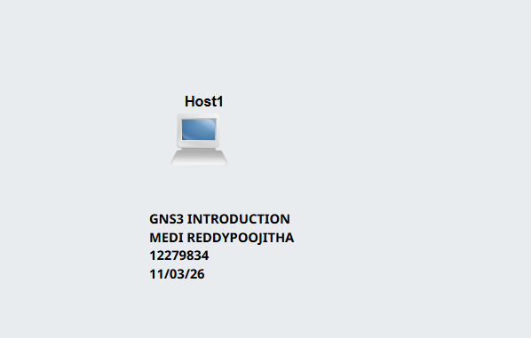
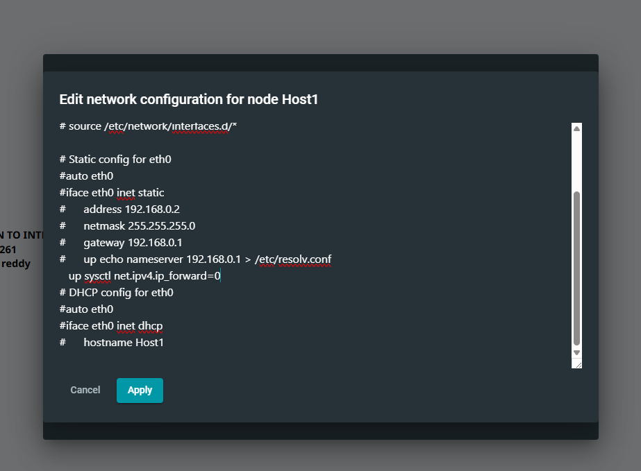

# Task 1 -Introduction to GNS3 Basics

- ## GNS3 Week 1 Activity Summary
  
- Created a new GNS3 project named **GNS3-Intro-12279834**.
- Added a single Linux host node (**Host1**) to the workspace.
- Added text in the project showing title, student name, student ID, and date.
- Selected a static IP address (e.g., **192.168.0.2**) for the host.
- Added text near the node showing the assigned IP address.
- Configured static IP using `/etc/network/interfaces` file before starting the node.
- Started the Host1 node successfully.
- Opened the web console in a new tab.
- Verified IP address using `ip a` command in the console.
- Confirmed that the system successfully received the configured static IP.
- Captured screenshot of network topology.
- Captured screenshot of IP address in console.
- Exported the project as **.gns3project** file.
- Ensured all required files and screenshots are ready for submission.
- Learned basic GNS3 setup and Linux network configuration.
