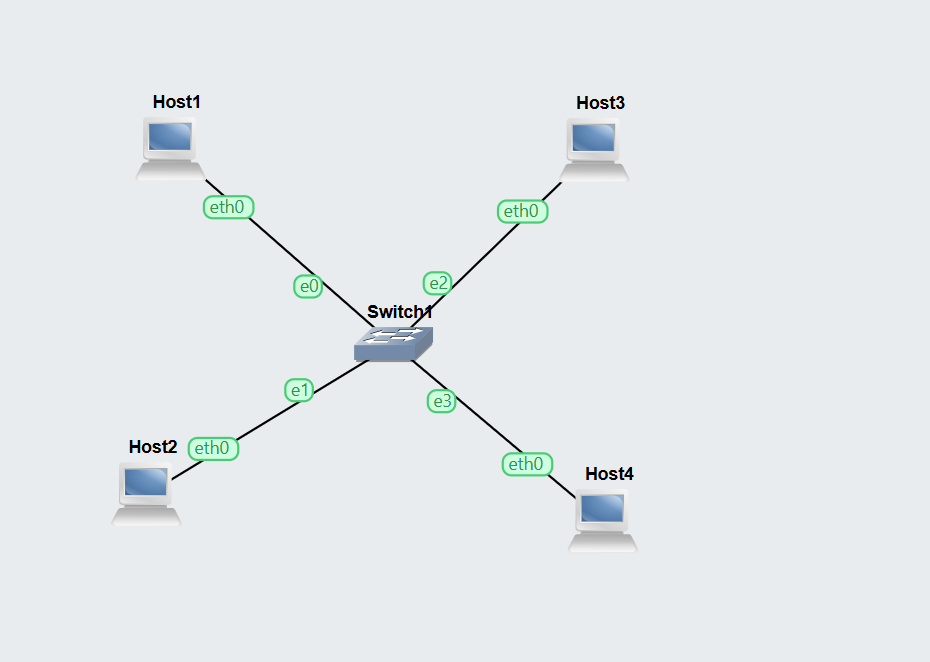
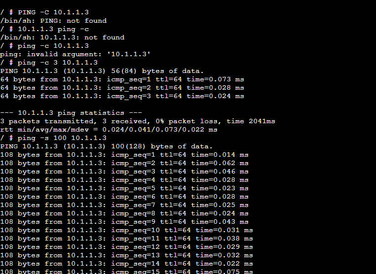
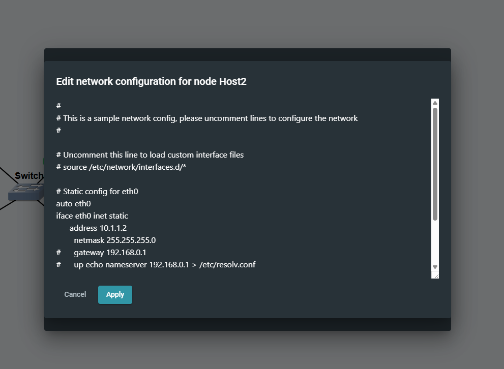
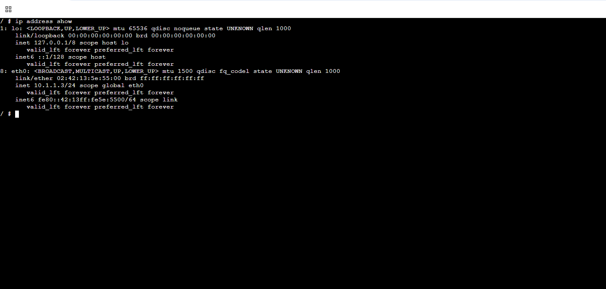
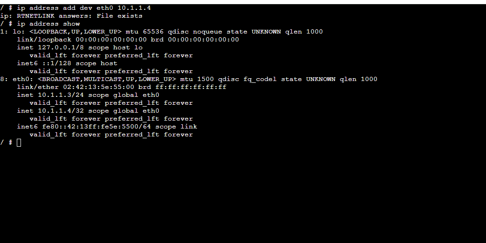

## Explanation of Ping Results

### 1. Simple Ping (Default)
- Command used: `ping 10.1.1.3`
- Tests basic connectivity between two hosts
- Each reply shows:
  - `icmp_seq` → packet sequence number
  - `ttl=64` → normal value for local network
  - `time` → round-trip delay (very low = fast connection)
- Result:
  - All packets sent were received
  - 0% packet loss
- Conclusion:
  - Network connection is working correctly

---

### 2. Ping to Wrong IP Address
- Command used: `ping 10.1.1.99`
- IP address does not exist in the network
- Result:
  - No replies received
  - 100% packet loss
- Conclusion:
  - Destination is unreachable
  - Helps identify incorrect IP or disconnected devices

---

### 3. Ping with Options
- Command used: `ping -c 100 -s 100 -i 0.2 10.1.1.3`
- Options used:
  - `-c 100` → send 100 packets
  - `-s 100` → increase packet size
  - `-i 0.2` → send packets every 0.2 seconds
- Result:
  - All 100 packets received
  - 0% packet loss
- Conclusion:
  - Network is stable under higher load
  - Can handle increased traffic without issues

### Overall Conclusion
- Ping is used to test network connectivity
- Successful replies indicate a working network
- Packet loss indicates network problems
- Options allow testing of performance and reliability

