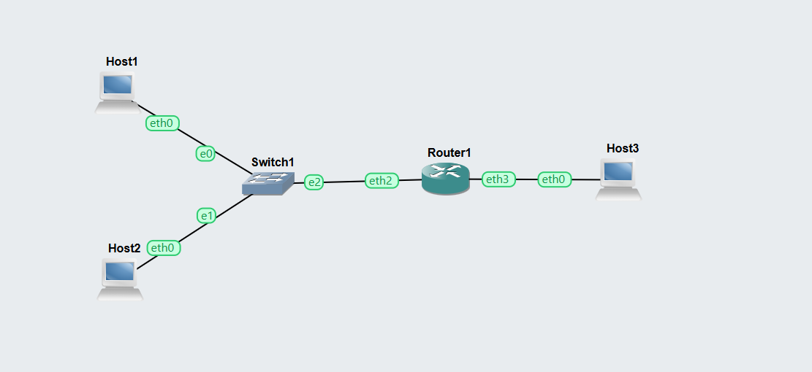
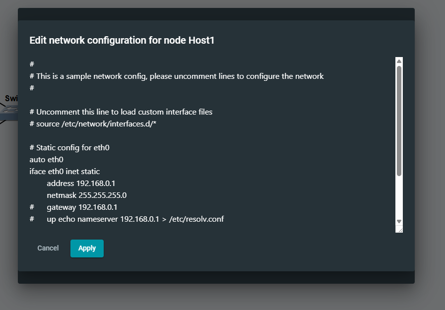
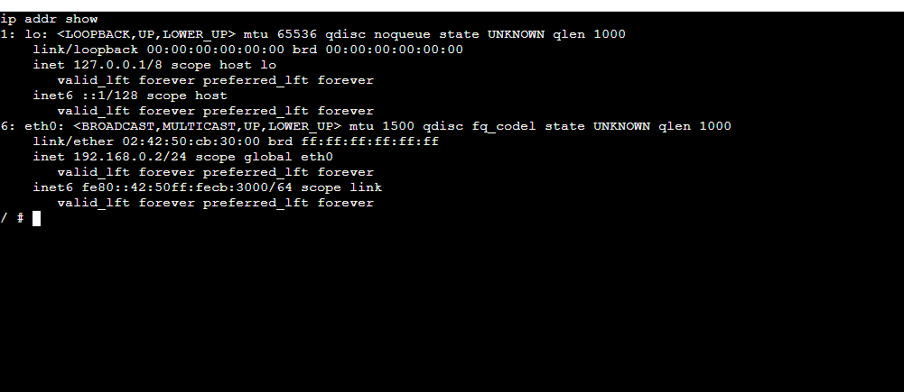
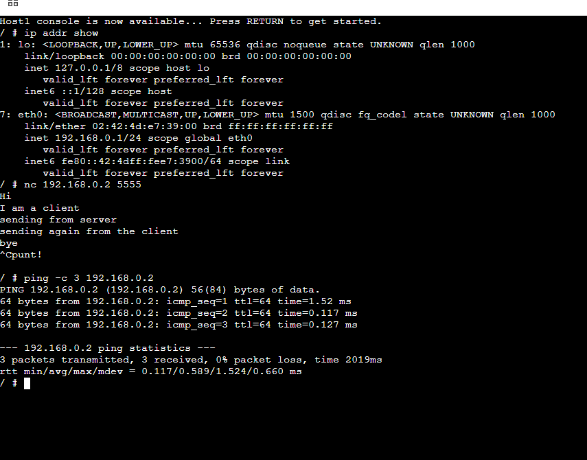
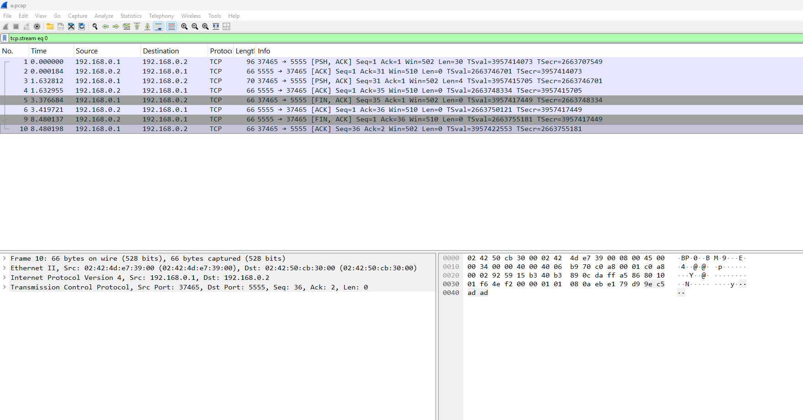
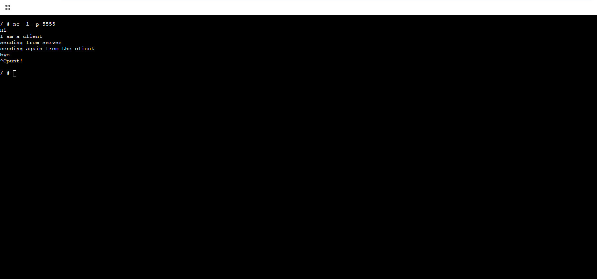
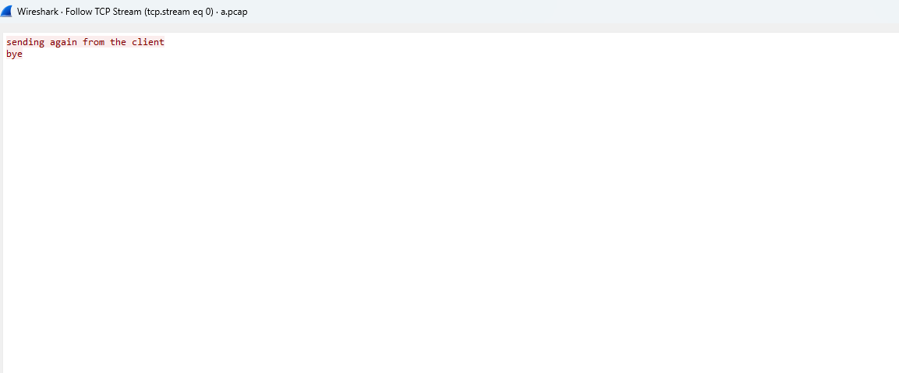

# Task -1

## Networking Diagram

## Topology Description
- Host1 (192.168.0.1) connected to Switch1
- Host2 (192.168.0.2) connected to Switch1
- Switch1 connected to Router1
- Router1 connected to Host3
  
## 3 IP Addressing and Interfaces

## Host2

IP Address: 192.168.0.2/24
Interface: eth0

### Router1
eth2 - connected to Switch1 (LAN)
eth3 - connected to Host3 network

## 4. Routing Table Summary

| Device   | Destination      | Next Hop |
|----------|----------------|----------|
| Host1    | 192.168.0.0/24 | Direct   |
| Host2    | 192.168.0.0/24 | Direct   |
| Router1  | LAN network    | Direct   |
| Router1  | Host3 network  | Direct   |

## 5. Ping Test (Successful)
# ping -c 3 192.168.0.2

PING 192.168.0.2 (192.168.0.2) 56(84) bytes of data.
64 bytes from 192.168.0.2: icmp_seq=1 ttl=64 time=1.52 ms
64 bytes from 192.168.0.2: icmp_seq=2 ttl=64 time=0.117 ms
64 bytes from 192.168.0.2: icmp_seq=3 ttl=64 time=0.127 ms
192.168.0.2 ping statistics
Result: Successful communication between hosts.

# Task -2
## 6. Netcat Communication Test

Hi
I am a client
sending from server
sending again from the client

## 7. Packet Capture (Wireshark Analysis)

### Observations
- TCP connection established between:
  - 192.168.0.1 and 192.168.0.2
- Port used: 5555
- TCP 3-way handshake observed
- Data transfer followed by connection termination

### Sample Packet Flow

| Source        | Destination   | Protocol | Info     |
|--------------|--------------|----------|----------|
| 192.168.0.1  | 192.168.0.2  | TCP      | PSH, ACK |
| 192.168.0.2  | 192.168.0.1  | TCP      | ACK      |
| 192.168.0.1  | 192.168.0.2  | TCP      | FIN, ACK |
| 192.168.0.2  | 192.168.0.1  | TCP      | FIN, ACK |

## 4. Routing Summary Table

| Router | Destination | Next Hop |
|--------|------------|----------|
| R1     | Network A  | R2       |
| R1     | Network B  | R3       |
| R2     | Network C  | R1       |
| R3     | Network A  | R1       |

## Reflection

This lab provided practical experience in configuring and analyzing basic network communication and dynamic routing using GNS3.

During the View Routes section, I learned how to inspect IP configurations using `ip addr` and verify connectivity using `ping`. The successful communication between Host1 and Host2 confirmed correct Layer 2 and Layer 3 configuration within the same subnet. Using `netcat` helped demonstrate how TCP connections are established and used for real data transfer, while Wireshark allowed me to observe the TCP three-way handshake, data exchange, and proper connection termination (FIN/ACK). This reinforced my understanding of how transport layer protocols operate in real networks.

