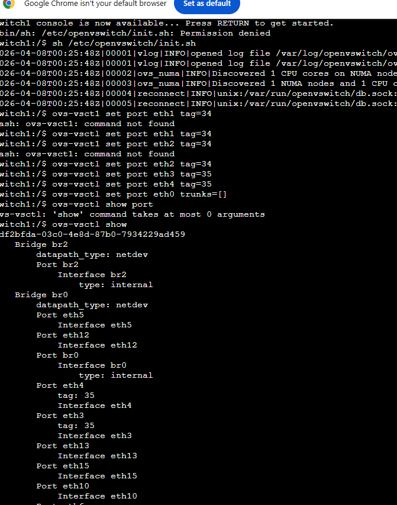

# VLAN Basics Lab (GNS3)

## Overview
This project demonstrates basic VLAN configuration using a switch in GNS3.  
Multiple hosts are connected to a switch, and VLAN tagging is used to segment the network.

##  Network Topology
The topology consists of:
- 4 Hosts (Host1, Host2, Host3, Host4)
- 1 Switch (Open vSwitch)
- 1 Router (optional for inter-VLAN routing)

Hosts are connected to different switch ports and assigned to VLANs.

### Network Topology

###  VLAN Port Configuration

## VLAN Configuration

The following commands were used on the switch:

# Assign VLAN 34
ovs-vsctl set port eth1 tag=34
ovs-vsctl set port eth2 tag=34

# Assign VLAN 35
ovs-vsctl set port eth3 tag=35
ovs-vsctl set port eth4 tag=35

# (Optional trunk port if needed)
ovs-vsctl set port eth5 trunks=34,35
