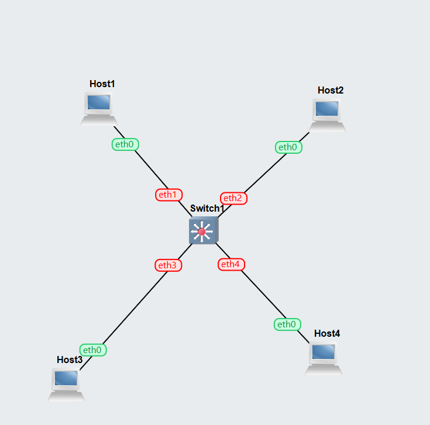
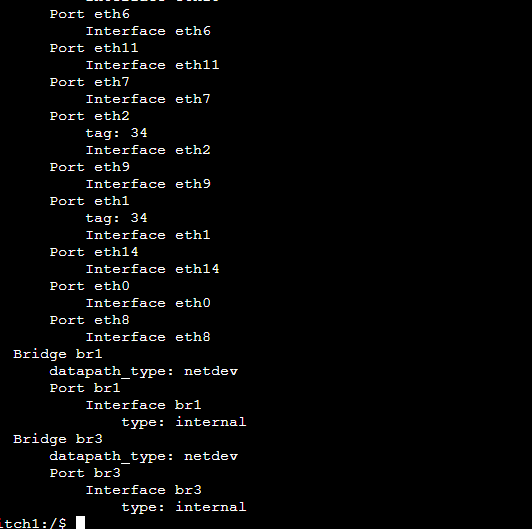
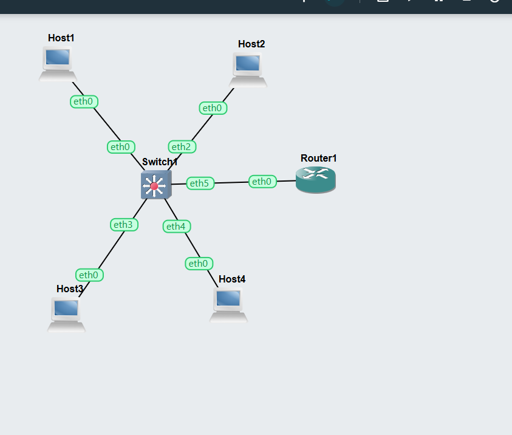
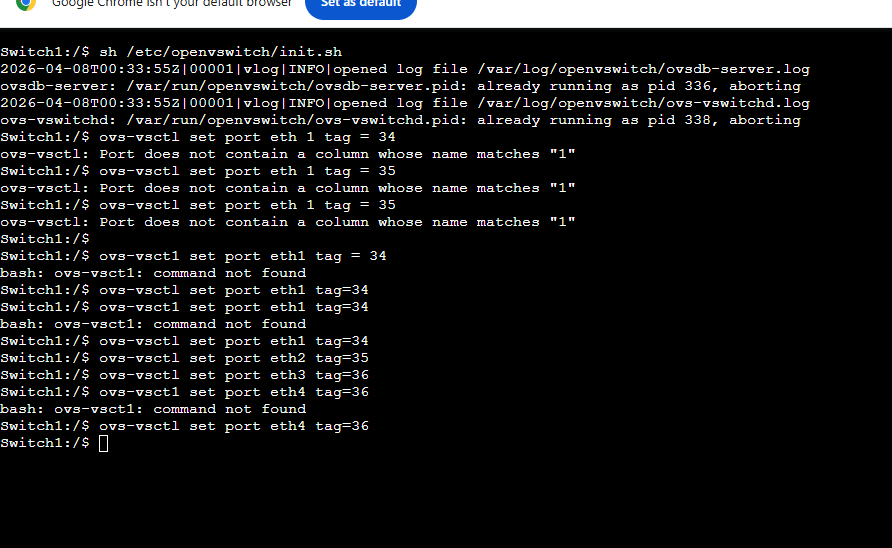

# Task-1

## Overview
This project demonstrates basic VLAN configuration using a switch in GNS3.  
Multiple hosts are connected to a switch, and VLAN tagging is used to segment the network.

##  Network Topology
The topology consists of:
- 4 Hosts (Host1, Host2, Host3, Host4)
- 1 Switch (Open vSwitch)
- 1 Router (optional for inter-VLAN routing)

Hosts are connected to different switch ports and assigned to VLANs.

### Network Topology

###  VLAN Port Configuration

## VLAN Configuration

The following commands were used on the switch:

# Assign VLAN 34
ovs-vsctl set port eth1 tag=34
ovs-vsctl set port eth2 tag=34

# Assign VLAN 35
ovs-vsctl set port eth3 tag=35
ovs-vsctl set port eth4 tag=35

# (Optional trunk port if needed)
ovs-vsctl set port eth5 trunks=34,35

# Task - 2

## Overview
This project demonstrates VLAN configuration and inter-VLAN routing using OpenvSwitch and a router in GNS3.  
The network includes 4 hosts connected to a switch and 1 router performing routing between VLANs.

### Components
- **Hosts:** Host1, Host2, Host3, Host4
- **Switch:** Open vSwitch (Switch1)
- **Router:** Router1 for inter-VLAN routing
## VLAN Configuration
The following VLANs were planned:
- VLAN 34 → Ports: `eth1`, `eth3`
- VLAN 35 → Ports: `eth2`, `eth4`
- Trunk Port → `eth5` to Router1
